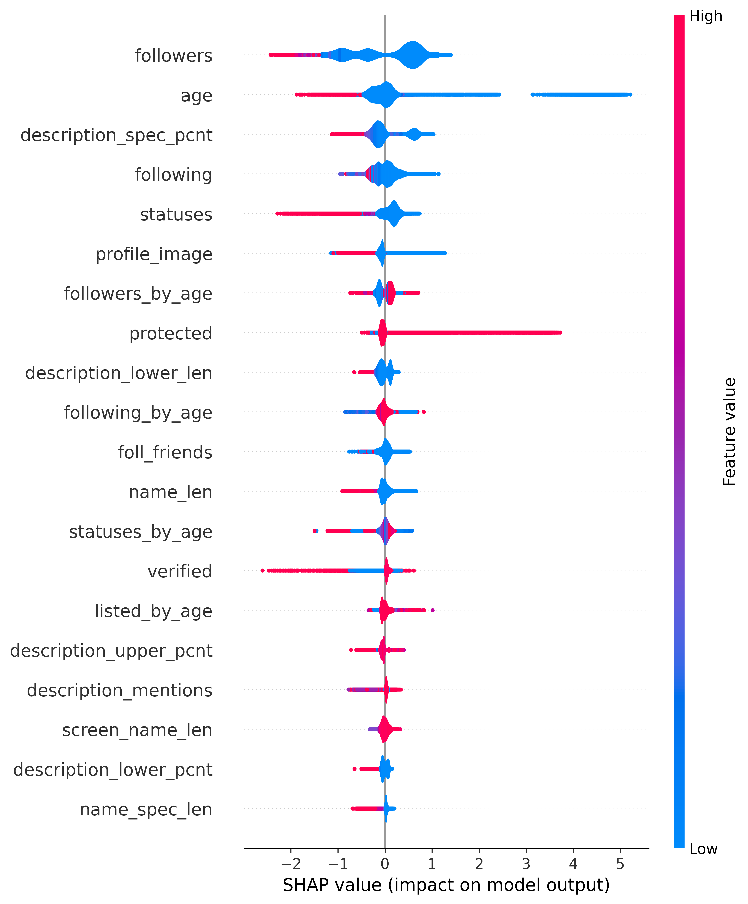

# BotArtist

Current GitHub repository provides implementation described in paper: "BotArtist: Generic approach for bot detection in Twitter via semi-automatic machine learning pipeline".
The implementation is separated into two repositories:
 - [SAMLP](https://anonymous.4open.science/r/SAMLP-C754): Contain the main implementation of the Semi Automatic 
Machine Learning Pipeline in order to be utilized in the future as separate tool.
 - BotArtist (current repository): The selected configurations, features and results made by SAMLP pipeline during the 
experiments described in the paper.

In this research paper we manage to replicate the dataset experiments and model comparison developed originally by 
[TwiBot 22 paper](https://twibot22.github.io/). More specifically, we manage to train selected models over the described 
above scenarios and compare they performances in terms of bot detection.

Additionally, we provide the new labeled dataset of anonymized 10.929.533 Twitter profiles which is correlated with 
already existing public anonymized text dataset of 127.275.386 tweets correlated with Russo-Ukrainian War discussion in 
Twitter ([Shevtsov et al.](https://zenodo.org/records/8431047)). In order to develop connection between existing 
anonymized text dataset and provided labeled Twitter profiles, we contact with the original authors and provide anonymized user 
identifiers that are processed with identical translation function and allow to connect both datasets and correlate user 
profiles with their tweets, mentions and retweets.

## Requirements
Please follow the requirements of the [SAMLP](https://anonymous.4open.science/r/SAMLP-C754) repository in order to properly install the SAMLP pipeline

## Datasets
As mentioned in the original paper we separated our experiments into two scenario:
 - Data specific: In this case model is trained and tested separately between nine datasets.
 - General : In this case we merge the training sets of the nine dataset into single training portion. The model is 
trained over this generic dataset and tested over the remaining test sets.

Towards the model creation and comparison we utilized nine publicly available datasets and their train/test splits 
described and provided by the [TwiBot 22 paper](https://twibot22.github.io/). 
### Features 
In the case if the BotArtist, we selected profile based features due the recent research that showed profile features 
performance over the long term user predictions. Based on this, we manage to extract 49 unique features from single 
profile object. In case of feature extraction over different dataset, you could utilize the:
'preprocessing/feature_extraction.py' script.

| Feature                    | Type    | Feature                     | Type        | Calculation                           |
|:---------------------------|:--------|:----------------------------|:------------|:--------------------------------------|
| name\_len                  | count   | screen\_name\_sim           | real-valued | Jaccard of (screen\_name, user\_name) |
| screen\_name\_len          | count   | foll\_friends               | real-valued | follower / friends                    |
| description\_len           | count   | age                         | real-valued | created\_at / collection date         |
| listed                     | count   | listed\_by\_age             | real-valued | listed / account age                  |
| statuses                   | count   | statuses\_by\_age           | real-valued | statuses / account age                |
| followers                  | count   | followers\_by\_age          | real-valued | followers / account age               |
| following                  | count   | following\_by\_age          | real-valued | friends / account age                 | 
| name\_upper\_len           | count   | name\_upper\_pcnt           | real-valued | percentage of upper case              |
| name\_lower\_len           | count   | name\_lower\_pcnt           | real-valued | percentage of lower case              |
| name\_digits\_len          | count   | name\_digits\_pcnt          | real-valued | percentage of digits                  |
| name\_special\_len         | count   | name\_special\_pcnt         | real-valued | percentage of other characters        |
| screen\_name\_upper\_len   | count   | screen\_name\_upper\_pcnt   | real-valued | percentage of upper case              |
| screen\_name\_lower\_len   | count   | screen\_name\_lower\_pcnt   | real-valued | percentage of lower case              |
| screen\_name\_digits\_len  | count   | screen\_name\_digits\_pcnt  | real-valued | percentage of digits                  |
| screen\_name\_special\_len | count   | screen\_name\_special\_pcnt | real-valued | percentage of other characters        |
| description\_upper\_len    | count   | description\_upper\_pcnt    | real-valued | percentage of upper case              |
| description\_lower\_len    | count   | description\_lower\_pcnt    | real-valued | percentage of lower case              |
| description\_digits\_len   | count   | description\_digits\_pcnt   | real-valued | percentage of digits                  |
| description\_special\_len  | count   | description\_special\_pcnt  | real-valued | percentage of other characters        |
| description\_urls          | count   | name\_entropy               | real-valued | entropy of user name                  |
| description\_mentions      | count   | screen\_name\_entropy       | real-valued | entropy of the screen name            |
| description\_hashtags      | count   | has\_location	              | boolean     |                                       |
| total\_urls                | count   | has\_profile\_image         | boolean     |                                       |
| protected                  | boolean | has\_profile\_url           | boolean     |                                       |
| location                   | boolean | url                         | boolean     |                                       |
| verified                   | boolean |                             |             |                                       |

### Data sharing
Additionally, we manage to collect  10.929.533 Twitter profiles via academic Twitter API (during the time period of 
23 February 2022 and 23 June 2023). We manage to extracted set of 49 unique features for each collected user profile 
(in order to extract features we manage to sort collected profiles by collection date and extract data based on the 
last user object). As mentioned in the paper, we manage to predict extracted dataset with the developed BotArtist model and 
provide additionally prediction labels (bot/human) and the prediction probability. Data is shared via:
 - CSV profile data : [Zenodo repository](https://zenodo.org/records/11203900) 
 - Croissant metadata: shared in the repository 'data/metadata.json' file.

### Data anonymization
In order to share the dataset and do not violate any user privacy and share any private or sensitive information, we 
share only set of extracted numeric features without any personal identifiers such userId, username, screenName and etc. 
Additionally, we share anonymized uid, which is anonymized user identifier which is created via non-reversible hash 
function and do not allow extraction of the original user identifier.

## Experiment re-creation
The entire experiments could be re-created with use of the original dataset described in the 
[TwiBot 22 paper](https://twibot22.github.io/).
On the next step you just required to provided extracted dataset into the SAMLP pipeline and the provided 
'configuration.py' file.

In case of the general approach you just repeat the procedure but, the training dataset should contain merged 
training sets from nine datasets.

## Results
As mentioned earlier, we separated the model comparison into two case scenarios data specific and the generic.
For more details please read description on the stats folder, where model configurations,selected features and detailed performances are stored.

In case of the data specific model comparison, we have the following model performances measured in the F1 score.

| Method         |  C-15       | G-17        | C-17        | M-18        | C-S-18      | C-R-19      | B-F-19      | TB-20       | TB-22       | Average   |
|:---------------|:------------|:------------|:------------|:------------|:------------|:------------|:------------|:------------|:------------|:----------|
| SGBot          | 77.9        | 72.1        | 94.6        | 99.5        | 82.3        | 82.7        | 49.6        | 84.9        | 36.6        | 75.57     |
| Kudugunta      | 75.3        | 49.8        | 91.7        | 94.5        | 50.9        | 49.2        | 49.6        | 47.3        | 51.7        | 62.22     |
| Hayawi         | 85.6        | 34.7        | 93.8        | 91.5        | 60.8        | 60.9        | 20.5        | 77.1        | 24.7        | 61.06     |
| BotHunter      | 97.2        | 69.2        | 91.6        | <u>99.6</u> | 82.2        | 82.9        | 49.6        | 79.1        | 23.5        | 74.98     |
| NameBot        | 83.4        | 44.8        | 85.7        | 91.6        | 61.1        | 67.5        | 38.5        | 65.1        | 0.5         | 59.80     |
| Abreu          | 76.4        | 66.7        | 95.0        | 97.9        | 76.9        | <u>83.5</u> | <u>53.8</u> | 77.1        | 53.4        | 75.63     |
| **BotArtist**  | 98.3        | <u>76.1</u> | 97.0        | **99.7**    | 80.6        | **88.3**    | **68.4**    | 82.2        | <u>58.2</u> | **83.19** |
| Cresci         | 1.17        | -           | 22.8        | -           | -           | -           | -           | 13.7        | -           | -         |
| Wei            | 82.7        | -           | 78.4        | -           | -           | -           | -           | 57.3        | 53.6        | -         |
| BGSRD          | 90.8        | 35.7        | 86.3        | 90.5        | 58.2        | 41.1        | 13.0        | 70.0        | 21.1        | 56.30     |
| RoBERTa        | 95.8        | -           | 94.3        | -           | -           | -           | -           | 73.1        | 20.5        | -         |
| T5             | 89.3        | -           | 92.3        | -           | -           | -           | -           | 70.5        | 20.2        | -         |
| Efthimion      | 94.1        | 5.2         | 91.8        | 95.9        | 68.2        | 71.7        | 0.0         | 67.2        | 27.5        | 57.95     |
| Kantepe        | 78.2        | -           | 79.4        | -           | -           | -           | -           | 62.2        | **58.7**    | -         |
| Miller         | 83.8        | 59.9        | 86.8        | 91.1        | 56.8        | 43.6        | 0.0         | 74.8        | 45.3        | 60.23     |
| Varol          | 94.7        | -           | -           | -           | -           | -           | -           | 81.1        | 27.5        | -         |
| Kouvela        | 98.2        | 66.6        | <u>99.1</u> | 98.2        | 80.4        | 81.1        | 28.1        | 86.5        | 30.0        | 74.24     |
| Santos         | 78.8        | 14.5        | 83.0        | 92.4        | 65.2        | 75.7        | 21.0        | 60.3        | -           | -         |
| Lee            | <u>98.6</u> | 67.8        | **99.3**    | 97.9        | <u>82.5</u> | 82.7        | 50.3        | 80.0        | 30.4        | 76.61     |
| LOBO           | **98.8**    | -           | 97.7        | -           | -           | -           | -           | 80.8        | 38.6        | -         |
| Moghaddam      | 73.9        | -           | -           | -           | -           | -           | -           | 79.9        | 32.1        | -         |
| Alhosseini     | 92.2        | -           | -           | -           | -           | -           | -           | 72.0        | 38.1        | -         |
| Knauth         | 91.2        | 39.1        | 93.4        | 91.3        | **94.0**    | 54.2        | 41.3        | 85.2        | 37.1        | 69.64     |
| FriendBot      | 97.6        | -           | 87.4        | -           | -           | -           | -           | 80.0        | -           | -         |
| SATAR          | 95.0        | -           | -           | -           | -           | -           | -           | 86.1        | -           | -         |
| Botometer      | 66.9        | **77.4**    | 96.1        | 46.0        | 79.6        | 79.0        | 30.8        | 53.1        | 42.8        | 63.5      |
| Rodrifuez-Ruiz | 87.7        | -           | 85.7        | -           | -           | -           | -           | 63.1        | 56.6        | -         |
| GraphHist      | 84.5        | -           | -           | -           | -           | -           | -           | 67.6        | -           | -         |
| EvolveBot      | 90.1        | -           | -           | -           | -           | -           | -           | 69.7        | 14.1        | -         |
| Dehghan        | 88.3        | -           | -           | -           | -           | -           | -           | 76.2        | -           | -         |
| GCN            | 97.2        | -           | -           | -           | -           | -           | -           | 80.8        | 54.9        | -         |
| GAT            | 97.6        | -           | -           | -           | -           | -           | -           | 85.2        | 55.8        | -         |
| HGT            | 96.9        | -           | -           | -           | -           | -           | -           | **88.2**    | 39.6        | -         |
| SimpleHGN      | 97.5        | -           | -           | -           | -           | -           | -           | **88.2**    | 45.4        | -         |
| BotRGCN        | 97.3        | -           | -           | -           | -           | -           | -           | 87.3        | 57.5        | -         |
| RGT            | 97.8        | -           | -           | -           | -           | -           | -           | <u>88.0</u> | 42.9        | -         |

In case of the generic performance measurements we selected best models (according to the performance) and the 
Botometer model (since the Botometer do not require any additional training and could be used as is). According to our 
experiments we have the following performance results, measured in F1 score.

| Method           | C-15        | G-17        | C-17        | M-18        | C-S-18      | C-R-19      | B-F-19   | TB-20       | TB-22       | Total       | Average     |
|:-----------------|:------------|:------------|:------------|:------------|:------------|:------------|:---------|:------------|:------------|:------------|:------------|
| BotArtist        | 82.7        | <u>39.9</u> | 87.3        | <u>99.0</u> | **80.6**    | <u>73.8</u> | 16.6     | **80.3**    | **56.9**    | **63.7**    | **68.5**    | 
| Lee              | 82.3        | 0.0         | 83.6        | 97.7        | 78.2        | 67.7        | 20.0     | 8.5         | 42.4        | 52.9        | 53.3        | 
| Abreu            | <u>84.4</u> | 0.3         | 80.1        | 88.4        | 67.1        | 40.8        | 11.7     | 15.6        | 29.0        | 40.4        | 46.3        | 
| SGBot            | 75.0        | 3.6         | 79.8        | **99.2**    | 76.7        | 68.9        | 0.0      | 15.2        | <u>43.3</u> | <u>53.8</u> | 51.5        | 
| BotHunter        | 73.4        | 7.1         | 76.0        | **99.2**    | 76.0        | 44.8        | 11.1     | 14.7        | 28.0        | 43.1        | 47.8        | 
| Kouvela          | **95.5**    | 20.4        | <u>94.7</u> | 98.1        | 78.4        | 71.4        | 21.0     | 28.5        | 36.0        | 52.0        | 60.5        | 
| Botometer        | 66.9        | **77.4**    | **96.1**    | 46.0        | <u>79.6</u> | **79.0**    | **30.8** | <u>53.1</u> | 42.8        | 45.3        | <u>63.5</u> | 

## Model Explainability
As part of our model creation we manage to perform model explainability with use of the SHAP method over the final BotArtist version:

## Model sharing 
The developed BotArtist model could be re-created via SAMLP pipeline via the public dataset with use of the shared 
selected model configuration and selected features. Besides that, we also will upload separately the sored model in 
the format of pickle file that could be just load as is and used toward profile prediction after the paper acceptance.

## License:
Attribution-NonCommercial-ShareAlike 4.0 International: [CC BY-NC-SA 4.0 DEED](https://creativecommons.org/licenses/by-nc-sa/4.0/)
## Citation:
TBD